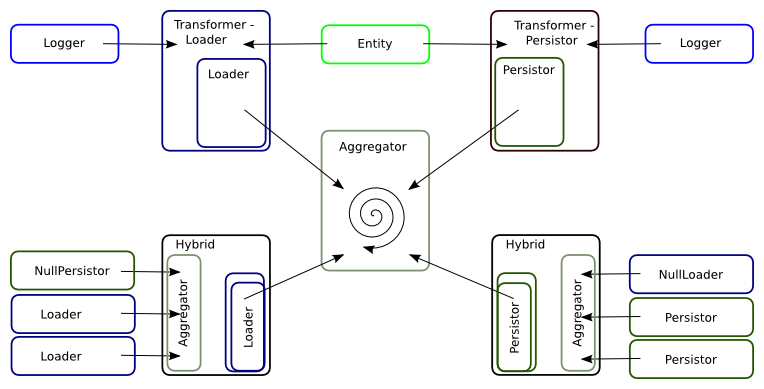

# Liip DataAggregator


## Current Travis Status

[](https://travis-ci.org/liip/DataAggregator)


## Purpose
The DataAggregator provides a structured way to fetch/retrieve information form different sources, process
this information, and to persist it even to several destinations at once.
To be able to archive this it is build on a threefold of component types:

- the loader
- the aggregator
- the persistor

Furthermore the goal of this library is to be as small as it can be providing the most and simplest way to
be extended and altered to one's personal needs.

### The managing component - the aggregator
The aggregator is the heart of the library. Since itself do not have any knowledge about the structure of
the information shared between a loader and a persistor it takes care of the connection between those two and manages
their interaction. Being a simple registry loaders and persistors get attached to it and run iteratively.
Since it shall not have any knowledge about the transfer format it should not process nor alter the information it
passes through.

### The information fetching/retrieving component - the loader
The name already unveils to purpose of this component. It has all knowledge of how to extract information from a request
or response. The source and format of the data is loader specific.
Still following the idea of haveing a footprint as lean and small as possible the interface of a loader requires only
two methods.
One (load()) to actually extract the data from a response and a second (stopPropagation()) to notify the aggregator
hat it might be a good idea to stop invoking every other reggistered loader. This might be the case when a loader was
setup as a filter mechanism and the result being return is already empty.

### The information storage - the persistor
The purpose of the persistor is to make the information retrieved from the aggregator permanently available.
This also means that the loader and persistor must have the same idea about the information passed between them.
Furthermore it is possible for the persistor to process the data to be stored.

### Special flavors
#### the Hybrid
Imagine an implementation acting towards a loader as an aggregator and towards an aggregator as a loader.
This makes it possible to encapsulate a specific set of sources to one loader and provide the collected and probably
already process information to the aggregator on the 1st level of your implementation. This makes it even easier
to reuse loaders and persistors and should encourage you to follow all the nice oop principles out there (SOLID, DRY, ...).

#### the transformers
As the sketch shows the transformers are a more general approach to create a special transfer format (like e.g. a Doctrine entity) form the loaded data. This makes it much easier for an invoked persistor to do his work. Further a dedicated data validation can be introduced in the named transfer format.

### Concept sketch


## Installation
The source is now PSR-0 compatible. There is no specific installation routine to be followed. Just clone or checkout
the source into to your project and use it. In case you don't use a
[PSR-0](https://github.com/php-fig/fig-standards/blob/master/accepted/PSR-0.md) compatible autoloader, you only have
to add the `bootstrap.php` into your bootstrap or autoloader.

###Composer
Add the following lines to your `composer.json` file and update your project's composer installation.

```json
{
    "require": {
       "liip/dataaggregator": "dev-master"
    }
}
```

This composer configuration will checkout the 'cutting edge' version ('dev-master') of the project. Be alarmed that this might be broken sometimes.


**NOTE:**
In case you do not know what this means the [composer project website](http://getcomposer.org) is a good place to start.


### Github
Thus I recommend the composer way to make DataAggregator a dependency to your project.
The sources are also available via github. Just clone it as you might be familiar with.

```bash
$ git clone git://github.com/liip/DataAggregator.git
```

## Logging
This project does for different reasons favor Monolog for the logger of choice. Unfortunately Monolog does not implement
the Psr\Log\LoggerInterface. Therefor an Adaptor was implemented to bring the two worlds together.
So in case you want to use a monolog logger use the MonologAdaptor as dependency instead of monolog directly.

**Update 2013-01-12**: @gnutix brought to my attention that [Monolog](https://github.com/Seldaek/monolog) just added support for the [Psr-3](https://github.com/php-fig/fig-standards/blob/master/accepted/PSR-3-logger-interface.md). This is actually good news, it soon will be possible to get rid of the formerly introduced [MonoLogAdaptor](https://github.com/liip/DataAggregator/blob/master/src/Liip/DataAggregator/Adaptor/Logger/MonologAdaptor.php).
Kudos to everyone involved in that achievement.

## Dependencies
- Assert (http://github.com/beberlei/assert)

## Suggestions
- Monolog (https://github.com/Seldaek/monolog)
